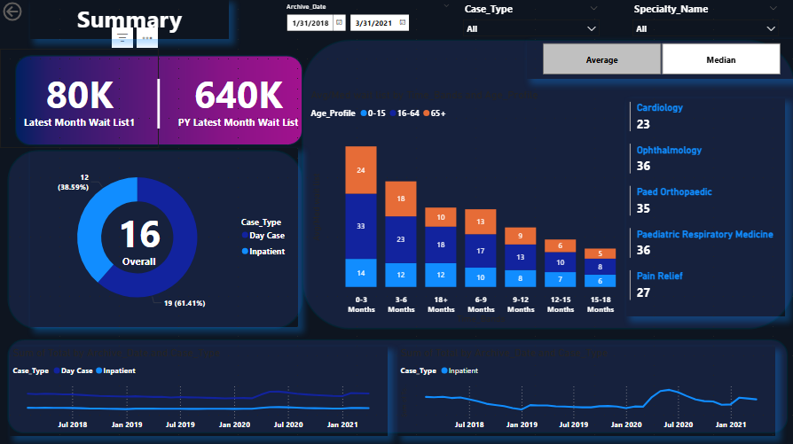

# 🏥 Healthcare Waitlist Analytics – Power BI Dashboard  
### Comprehensive Patient Waitlist Monitoring & Insight System

## 📌 Overview
This Power BI project provides a complete analytical view of **Hospital Patient Waitlists** across multiple specialties, age groups, and case types (Inpatient / Day Case).  
The dashboard transforms raw healthcare waitlist data into clear, interactive insights that support **capacity planning**, **performance tracking**, and **clinical decision-making**.

The report consists of two key pages:
1. **Summary Dashboard**
2. **Detail Dashboard**

---
## 📷 Healthcare Waitlist Dashboard 

## 🎯 Objectives
- Monitor **latest monthly wait list size** and compare it with previous year totals.
- Provide **real-time tracking** of inpatient and day-case patient wait numbers.
- Visualize waitlist distribution by:
  - Age Profile  
  - Specialty  
  - Case Type  
  - Time Bands (0–3 months, 3–6 months, etc.)
- Track historical performance using **Archive Date** trends.
- Provide a user-friendly, interactive interface for healthcare leaders and analysts.

---

## 📊 Key Features

### 🔹 1. Summary Metrics
- Latest Month Wait List  
- Previous Year Wait List  
- Overall Patient Count with donut chart breakdown (Inpatient / Day Case)

### 🔹 2. Specialty Breakdown
Clear distribution of patient counts across specialties such as:
- Ophthalmology  
- Cardiology  
- Paediatric Respiratory Medicine  
- Paed Orthopaedic  
- Pain Relief  
…etc.

### 🔹 3. Age Profile Analysis
Stacked bar chart showing waitlist segmentation by:
- 0–15  
- 16–64  
- 65+  

Across time-band categories:
0–3 months, 3–6 months, 6–9 months, ... 12–15 months, 15–18 months.

### 🔹 4. Time Trend Analysis
Line charts tracking:
- Total inpatient trends  
- Total day-case trends  
Over the archive period (Jan 2018 – Mar 2021)

### 🔹 5. Interactive Filters
Users can filter instantly by:
- Archive Date range  
- Specialty Name  
- Case Type  
- Age Profile  
- Calculation Method (Average / Median)

---

## 🗂️ Dataset Description
**Dataset Name:** `Hospital_Waitlist_Data`

### Key Columns
| Column Name | Description |
|-------------|-------------|
| Archive_Date | Monthly snapshot of waitlist data |
| Case_Type | Inpatient / Day Case classification |
| Specialty_Name | Medical specialty category |
| Age_Profile | Age group classification |
| Time_Bands | Waiting duration category |
| Latest Month Wait List1 | Latest month waitlist count |
| PY Latest Month Wait List | Previous year waitlist count |
| Average wait list | Calculated average wait times |
| Median wait list | Calculated median wait times |

---

## 🛠️ Technology Stack
- Power BI Desktop  
- DAX Measures  
- Power Query (ETL)  
- Interactive Visual Analytics  

---

## 📁 Project Structure
